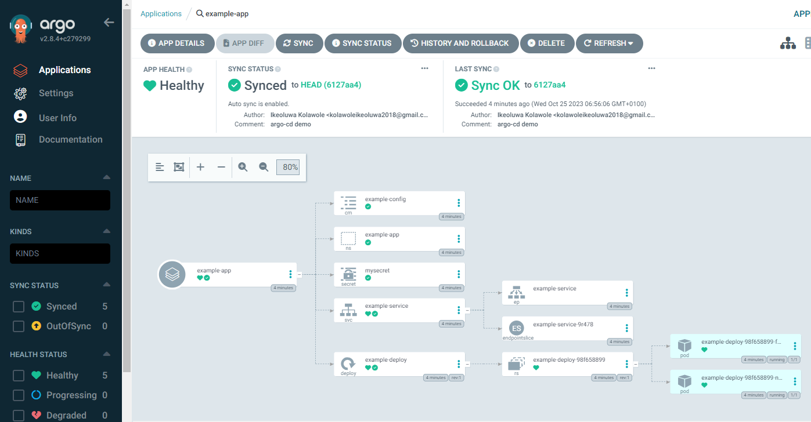
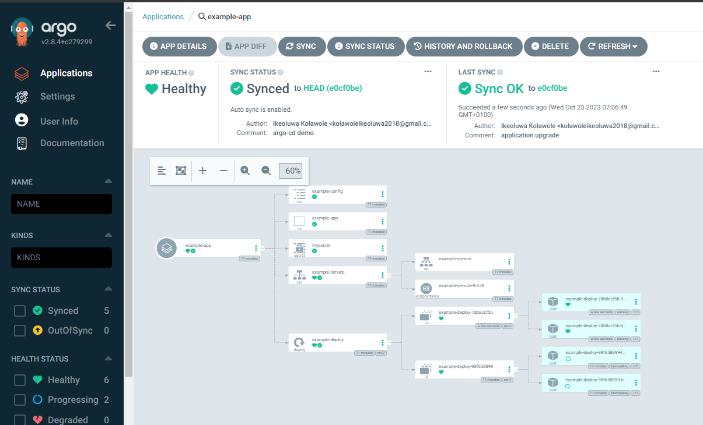

# Introduction to Argo CD

1. Setup Argo CD Controllers:

Checkout Argo CD documentation https://argo-cd.readthedocs.io/en/stable/getting_started/.

Argo CD deployment manifest can be examined in the `install.yaml` file in `argo-cd` directory.

```
kubectl -n argocd apply -f ./argo/argo-cd/install.yaml
```

View CRDs:

```
kubectl -n argocd get pods
```

```
NAME                                                READY   STATUS    RESTARTS   AGE
argocd-application-controller-0                     1/1     Running   0          4m22s
argocd-applicationset-controller-745cd84657-ngzlc   1/1     Running   0          4m22s
argocd-dex-server-684c58b4b5-76rx4                  1/1     Running   0          4m22s
argocd-notifications-controller-f5877f4fb-bhn7q     1/1     Running   0          4m22s
argocd-redis-685866888c-tv4p4                       1/1     Running   0          4m22s
argocd-repo-server-76bc8c68b9-98kh2                 1/1     Running   0          4m22s
argocd-server-b456cd7d5-qvz8f                       1/1     Running   0          4m22
```

2. Access Argo Server

Use port forwarding to connect to the API server:

```
kubectl port-forward svc/argocd-server -n argocd 8080:443
```

Login with Argo CD Default credentials:

```
username: admin

# get password
password: kubectl -n argocd get secret argocd-initial-admin-secret -o jsonpath="{.data.password}" | base64 -d
```

3. Deploy Applications

Deploy IAC k8s manifests using the Argo CD deployment manifest `app.yaml`

```
kubectl apply -n argocd -f ./argo/argo-cd/app.yaml
```

Review Deployments on ArgoCD UI:



4. Continuous Deployments

Simulate an application upgrade by incrementing the docker image version in `example-app/deployment.yaml` manifest.

```
aimvector/python:1.0.1
```

Push changes to GitOps Repository.

Notice ArgoCD is taking down the old pods and deploying the revised version of our application


